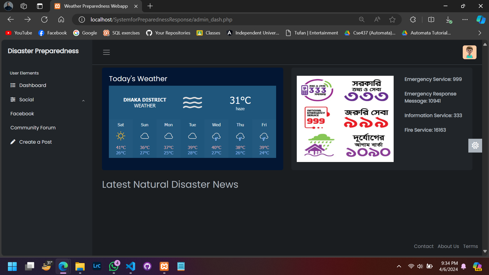

# Disaster Preparedness and Response System



## Overview

The Disaster Preparedness and Response System is a comprehensive platform designed to enhance preparedness and coordination efforts for natural disasters. It integrates real-time data on weather patterns, geographical vulnerabilities, emergency resources, and population demographics to facilitate effective decision-making and collaboration among stakeholders.

## Features

- Real-time data integration from weather monitoring systems, GIS databases, and emergency resource repositories.
- Predictive analytics for forecasting potential natural disasters and assessing their impact on different regions.
- GIS mapping tools for visualizing data and identifying vulnerable areas and critical infrastructure.
- Communication and collaboration tools for sharing information and coordinating response efforts.
- Resource management system for tracking and allocating emergency resources based on real-time needs.
- Community engagement and education initiatives for raising awareness and disseminating information to the public.
- Training exercises and simulations to test response plans and identify areas for improvement.
- Cross-agency coordination protocols to ensure seamless cooperation among different organizations involved in disaster management.

## Installation

1. Clone the repository:

   ```bash
   git clone https://github.com/mahbublimon/SystemforPreparednessResponse.git
   ```

2. Install dependencies:

   ```bash
   cd SystemforPreparednessResponse
   npm install
   ```

3. Configure environment variables:

   ```bash
   cp .env.example .env
   ```

   Update the `.env` file with your configuration settings.

4. Start the application:

   ```bash
   npm start
   ```

5. Access the application at `http://localhost:3000`.

## Contributing

Contributions are welcome! Please open an issue or submit a pull request to propose changes or new features.

## License

This project is licensed under the [MIT License](LICENSE).

---
